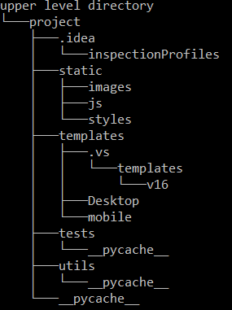

# eXeplore - Exeter Exploration game
> A treasure hunt game to introduce new students to the Exeter University campus.

## Table of contents
* [General info](#general-info)
* [Technologies](#built-with)
* [Usage](#usage)
    * [Source Tree](#source-tree)
    * [Install instructions](#pipenv-install-instructions)
    * [Database Requirements](#database-requirements)
    * [Running the app](#running-the-app-locally)
* [Deploying to IBM Cloud](#deployment-on-the-ibm-cloud)
* [Features](#features)
* [Status](#usage)

## General info
The eXeplore game is a web app that runs online and allows students to explore the campus through a range of clues and questions. 
This document details how you can deploy and edit the app for your personal usage.

## Built With
* Python - version 3.7.3 used as the backend for the web app
* Flask - version 1.1.1 used to power the backend, popular python web library
* Werkzeug - version 0.15.4 offers security features, password hashing and storage
* pipenv - version  2018.11.26, used to handle python requirements

* HTML and CSS - used to create the front end
## Dependencies 
#### Python Libraries
* Flask_testing - version 0.8.0, Library that allows flask to be unit tested
* ibm_db - version 3.0.1, Library that allows access to DB2 database
* ibmcloudevn - version 0.2.1, Library that allows interaction with IBM cloud functions such as VCAP_SERVICES
* pipfile - version 0.0.2, Library allows the IBM cloud to install all python dependencies from pipfile
* requests - version 2.23.0, Library extension to python flask to handle requests

## Usage
### Development
If you want to customise the game for your usage follow these steps:
* Select the version of the app you would like to install.
* Select the branch that reflects this version choice.
* Create a Local git repository `git init` in the desired file location.
* Then clone the repository using `git clone [URL]` where URL represents the url for your chosen branch

### User Flow
The following diagrams explain the desired user flow of the application. When adding or changing features please consider the overall flow
of the application.

[TutorFlow](Images/Demo/GamekeeperSolutionFlow.jpg) - The flow of the program for tutor users  
[UserFlow](Images/Demo/StudentSolutionFlow.jpg) - The flow of the program for Student users 

### Source Tree
* #### General Files
    * [Manage.py](manage.py) - The main file for running the flask server both locally and on the cloud
    * [databaseAdapter.py](databaseAdapter.py) - File responsible for handling all the database connections and requests
    * [servicesConfig.json](servicesConfig.json) - Where you can put access parameters for your personal IBM cloud services
    * [pipfile](Pipfile) - Used to install python dependencies
    * [Tests Directory](tests) - Holds all the unit tests for the app
    * [utils](utils) - Holds all supporting functions such as password hashing.
    * [Templates](templates) - Holds all the HTML for the Screens
    * [Static](static) - Holds all the static assets
        *    [images](images) - All the images used in the app
        * [js](js) - All the java script files
        * [styles](styles) - all the CSS files
* #### IBM cloud specific Files
    * [Manifest.yml](manifest.yml) - Used to connect IBM cloud services to the app and deploy to the correct Cloud Foundry space
    * [Procfile](Procfile) - Informs the server what file to execute on boot
    * [runtime.txt](runtime.txt) - Used to set the python version on the IBM cloud

### Pipenv install instructions
This project uses pipenv to handle its pip requirements, this also allows automatic install in a cloud environment. 
* First install pipenv to you python environment using `pip install pipenv`. This will install pipenv to your python runtime environment.
* Using a terminal navigate to the location of the cloned repo and instantiate a pipenv environment using the command `pipenv install`
* Then simply run the command `pipenv sync` which will install all the required libraries to the new virtual python environment.

### Database requirements
This program relies on a DB2 database however this could be changed to work with the database of your choice. All database access code is handled in
the [databaseAdapter.py](databaseAdapter.py). Here you can change the connection settings for the database to work with your chosen implementation.
The design of the database is explained in [Databasefile](databaseFile).
It follows the following schema. 
 
You can create the database locally using the provided SQL files [SqLfiles](linktofiles) 
the database offers the functionality to store...  
If using the IBM cloud you can access your DB2 database by updating the servicesConfig.json file with parameters found in your apps 
environment variables (Full instructions [below](#deployment-on-the-ibm-cloud)).

### Running the app locally
To run the app locally you must run the manage.py script this will start a flask server on your local IP (local host) on port 8000. 
Manage.py must be run from the root directory. It can be run using a python IDE or using a terminal.  
When using a terminal use the command `python manage` from within the projects repository.

### Running the unit tests
As the unit tests take advanatage of many of the files require to run the application they must be executed from the highest directory level.
For example if you have stored the files like below the tests must be run from within the project folder.  All tests can be run using
`python -m unittest discover tests` or individual unit tests can be executed via `python -m tests.[UnitName]` 
 

## Deployment on the IBM cloud
This app has been developed to be deployed on the IBM cloud as a foundry app. To do this you can follow the steps bellow:
* step 1
* step 1
* step 1
* step 1
* step 1
* step 1

## Code Examples
Show examples of usage:
`put-your-code-here`

## Features
List of features ready and TODOs for future development
* Registration and login capabilities customisable to your institution email
* A full game with a predefined route for use within the Exeter University campus
* Leaderboards with current team scores 

To-do list:
* A fully functional dashboard for tutors

## Status
Project is: _in progress_  
We are still actively developing the eXeplore app and look forward to pushing new and exciting features in the near future. 
